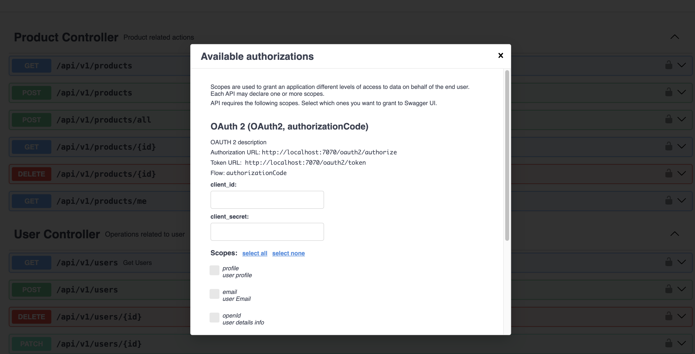
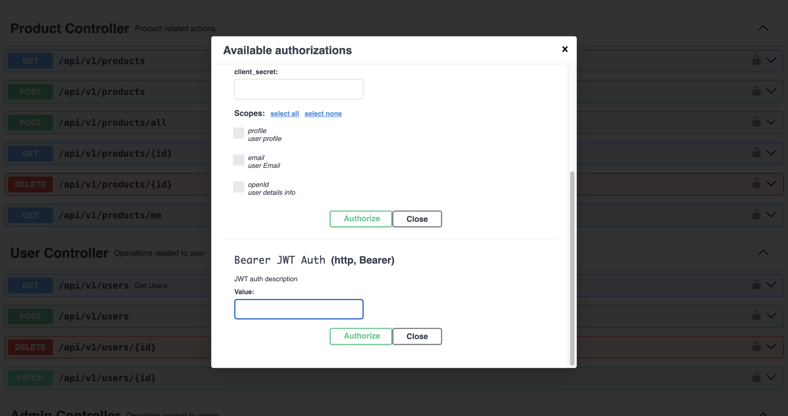
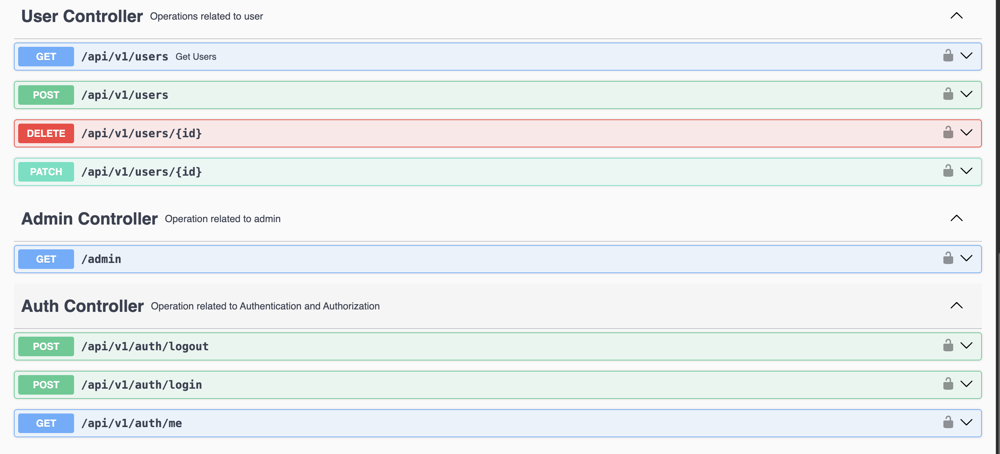

# Advanced Spring Security

This project is a secure backend application built using **Java 17**, **Spring Boot**, **PostgreSQL**, and **Gradle**.  
It demonstrates an enterprise-grade security implementation featuring **stateful JWT authentication**, custom permission logic, method-level authorization, and CI/CD with Docker image deployment.

🌐 **Live Demo:** [http://51.44.171.166/](http://51.44.171.166/)

📚 **API Documentation:** Click the "View API Documentation" button to access Swagger UI

---

## 🛠️ Tech Stack

| Component            | Technology |
|---------------------|------------|
| Language            | Java 17 |
| Framework           | Spring Boot |
| Build Tool          | Gradle |
| Database            | PostgreSQL |
| Security            | Spring Security (JWT, Method Security, PermissionEvaluator) |
| CI/CD               | GitHub Actions |
| Containerization    | Docker (Image pushed to Docker Hub) |

---

## 🔐 Security Architecture

### 1. **Stateful JWT Authentication**
Although JWT tokens are typically used in stateless systems, this project uses a **stateful authentication approach**:
- JWT tokens are generated upon login
- The token is **stored in the database**
- The backend validates the token on each request **against the database**
- Tokens can be invalidated (logout, forced revocation)

This design provides:
- Better control over active sessions
- Ability to revoke compromised tokens
- Enterprise session audit capabilities

### 2. **Custom Authentication Filter**
- Extracts JWT from request headers
- Validates token and loads associated user session
- Sets `Authentication` in the security context

### 3. **Method-Level Authorization**
Using:
```java
@PreAuthorize
@PostAuthorize
@PostFilter
```



